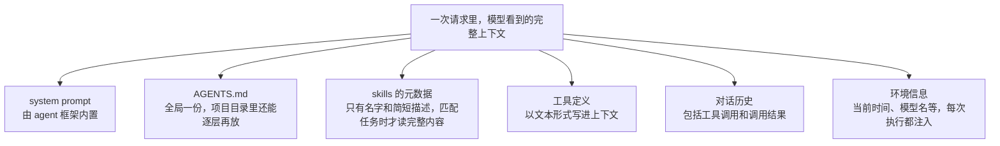
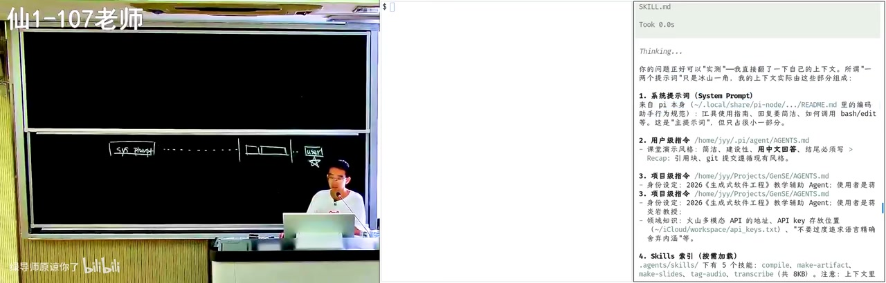
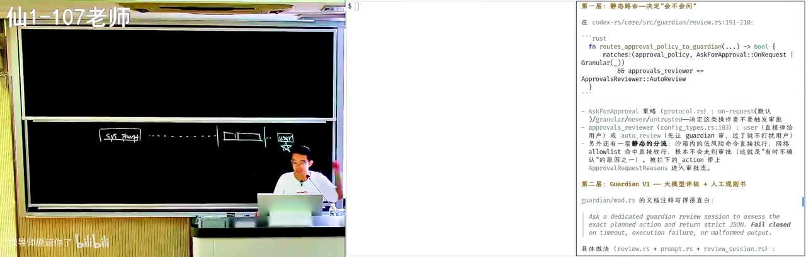
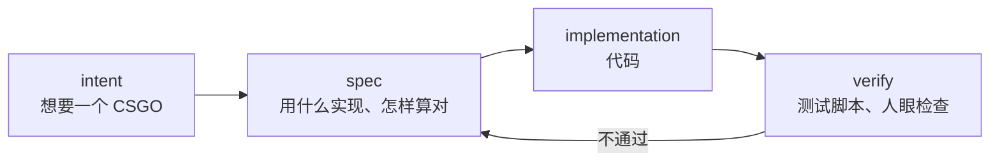
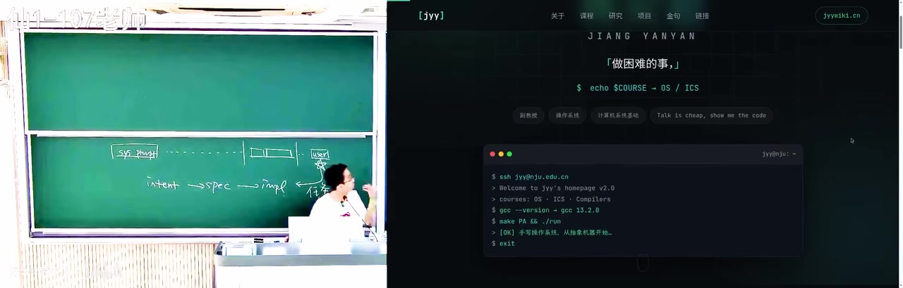
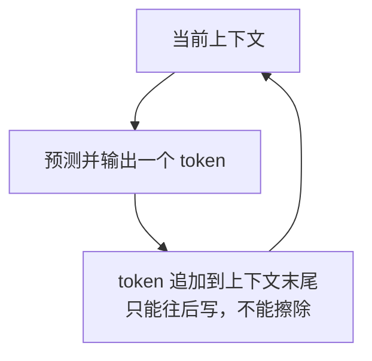
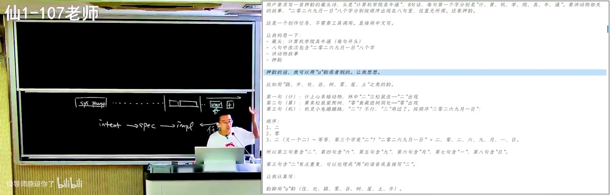

# 提示词工程：模型在你开口之前，已经读了很多东西

（00:00–03:30）

这节课讲的是生成式软件工程里最基础的一环：人和模型之间怎么沟通。表面上，沟通发生在聊天框里，你打一段话，模型回一段话。但如果你真的去看模型在回答你的第一句话之前手里有什么，会发现你打的那句话只是整个上下文里很小的一部分。

理解这一点，是理解"提示词工程"这四个字的前提。

***

## 一、模型看到的上下文，比你打的那句话长得多

（00:00–02:50）

当我们说"提示词"时，通常只想到自己在输入框里写的那句"帮我做一个什么什么"。这只是 user message。真正进入模型的是一个线性的序列，里面有这些内容：



几点需要说明：

* **system prompt 不是你写的**，它来自你用的 agent 框架，比如 Codex、Pi 之类。我上课演示用的机器在全局配置里写了"用中文回答"和"结尾必须写一个 recap"，所以我用英文提问，它仍然用中文回答，并且每次回答完都会先总结一遍做了什么。
* **AGENTS.md 是一层一层加载的**，全局有一份，项目目录里还可以再有一份，越靠近当前项目的规则越具体。
* **skills 不是整篇都塞进上下文**。模型平时只看到它的名字和一句简短的描述，判断当前任务匹配了，才去读完整的 skill.md，用完就从上下文里移除。这样做的原因显而易见：一个 skill 可能写得很长，全都常驻会把上下文塞满。
* **工具的定义也是文本**，就在上下文里。
* **环境信息每次执行都会重新注入**。这部分不算系统提示词，所以有些服务是可以被问出来的，比如你直接问 DeepSeek 当前是什么时间、什么模型。

所有这些叠在一起，构成一条很长很长的序列。序列的末尾才是你的那句话。

### 让 agent 自己检查自己的上下文

（06:00–09:20）

有个很直接的验证方式：直接问它。

因为模型做的是 next token prediction，它本来就能看到自己上下文里的每一个 token，那么它应该能读出来。当然前提是没有明确的禁令——不少模型服务方会通过微调和系统提示词禁止套取系统上下文，因为它们不希望自己的框架细节被人看光。但如果你用的是开源框架，自己 debug 自己的 agent，就没有这个限制。

我当时的提示词大意是："老师上课说 agent 的上下文里不只是几个关键词，你能检查一下你的上下文里都有些什么吗？"

它的回答里逐条列了出来：系统提示词来自哪里、其中的要求是什么、然后打开了哪个路径下的 AGENTS.md、有哪些 skills 的缩影、工具是怎么定义的。



这个演示本身也说明了一件事：在 AI 时代学习，你不必先攒够知识再提问。听到一个概念，下一秒就可以开一个 agent 把它问清楚。

***

## 二、"提示词工程"其实是"上下文工程"

（03:16–03:35）

既然模型看到的是整个上下文，那么当我们说"优化提示词"的时候，真正在做的其实是安排整个上下文：系统提示词怎么写、加载哪些文件、放哪些 skill、什么时候注入什么信息、工具调用的结果怎么组织。

这也解释了为什么有些现象会出现。有一个流传很广的做法：在最早的 system prompt 里加一句"你每说一句话都要在后面加一个'喵'"。然后你和它工作很久之后，某一天突然发现那个"喵"不见了。这时你就知道，上下文要么被截断，要么被压缩过，模型开始跟不上前面的指令了。

这类观察是工程实践里慢慢积累出来的，也是这门课想讲的东西。

***

## 三、学习方法上的两个变化

（04:47–18:50）

### 1. 费曼学习法的成本降到接近于零

费曼学习法的核心是：你怎么判断自己真的懂了？反过来讲给别人听。过去这件事代价很高，因为你得找到一个愿意听你啰嗦的听众，而室友可能不感兴趣，也可能觉得你讲得太浅。

现在你可以先让 AI 当老师，一直追问到懂为止；然后自己当老师，让 AI 扮演一个什么都不知道的学生，听你讲，并且指出你哪里逻辑有错、有漏。正一遍反一遍，概念就清楚了。

AI 在这个角色上有一个人类比不了的优势：它不会嫌弃你问得基础，你也可以无限追问。

### 2. 复杂系统不再劝退

（13:30–18:50）

我留意到一个细节：Codex 在用 bash 工具时，有时会向用户确认，有时不会。这说明它对命令的风险做了判断。那么它是怎么判断的？

我把这个问题直接抛给了 agent，让它去读相关的代码。它搜出来的是这样的结构：有一层静态分流，沙箱内的低风险命令直接执行，命中网络白名单的也直接放行；不在白名单里的，就往提示词里注入一小段话，让大模型给一个风险评级。



你甚至可以让它把那段安全评估的提示词原样打印出来，然后自己改一改——比如把某个原本会被拒绝的要求改成不拒绝——再观察行为有没有变化。行为变了，就是这段提示词在起作用的证据。

这里值得对比的是过去。我大二大三接触 Linux 内核时，光是把它下载下来、搞清楚怎么编译，就花了很长时间，而且还是在已经有一定 Linux 使用经验的前提下。现在你不需要害怕任何一个软件系统的复杂度，因为它可以被直接提问。

顺带一提，这类小细节上的注意力，一定程度上决定了你能走多远。就像我上操作系统课时反复说的：有的同学从 PA1 做到 PA4，编辑器里一直挂着红线。有红线也能编译、也能做完，但这不是正确的做法——花一点时间把 include path 配好，你就能用跳转、重命名符号、批量重构这些功能。这些功能在大模型出现之前就已经存在，只是现在配置它们变得更容易了。

***

## 四、写好提示词的核心：补上 intent 和 implementation 之间的空白

（18:53–33:00）

软件工程里有一个老问题：你脑子里的 intent（想要一个国民级应用）和最后的 implementation（跑起来的代码）之间，隔着 spec——用什么语言、什么架构、什么数据流、怎样算做对了。这些细节定得越清楚，实现就越确定。

把模型放进这个流程里，原则是一样的：



如果你只给它一个模糊的 intent，它就会自己补全空白，然后沿着它补的方向一路走。这时候出现问题不是因为它不听话，而是因为你没说的部分，它替你说了。

### 一句话生成游戏的例子

（22:35–24:20）

Kimi K3 用一句话生成一个赛车游戏，效果非常漂亮：物理、碰撞、逻辑都对，画面上方还有一个后视镜，看起来像模像样。


但这可能不是你要的那个游戏。你脑袋里的那个游戏是有具体约束的：真实地图、现成的美术资产、特定的操作手感。你没有说出来，模型就不会去补。如果你说清楚"要复用真实地图和美术资产"，它可能真的会去 OpenStreetMap 下载开源地图，把南大仙林校区重新建模出来；你说清楚要用哪一套公开的车和树，它就不会自己从头画。

所以提示词要写清楚三件事：**我要一个什么东西，用什么实现，怎样才算正确。**

### 网页设计里的"AI 味"

（26:09–30:00）

同样的道理出现在设计上。我给出一句"一个现代风格的个人主页"，得到的页面确实很好看：滚动效果、浮动效果都很专业，甚至它读过我的主页，知道我也是终端风格。但你一看就知道这是 AI 生成的。


差别在哪里？看我自己主页的做法：它是一个真正的终端，可以接管道；放大看，字形是不完美的，因为我在渲染完之后加了一道后处理，让它带上打字机那种不均匀的质感。




你自己写了几行代码不是重点，重点是**风格这件事是可以被指定的**：需要一个什么样的终端、背景和前景什么颜色、渲染之后做什么后处理、排版是什么样式。这些设计掌握在你手里，前提是你得看过足够多的好东西，知道什么是好的，并且能把它说出来。

这也是为什么我担心下一代人。AI 生成的东西正在把审美同化——你去学校看欢送毕业生的海报，计算机学院楼下的也是同一种风格，就像短视频里的主角永远长着同一张脸。好在数字世界里还保存了大量 AI 之前的东西，多样性还在。多看、多记、多问"他到底是怎么想的、他的解空间是怎么被约束住的"，你才能说清楚自己想要什么。

### 技术选型：知道区别之后才能讨论

（31:47–33:00）

如果你已经知道几种语言之间的差别，知道以后上线会遇到什么问题，那你就可以和 AI 真正地讨论：做一个教育系统，后台用 Python、Java 还是 TypeScript？你可以让它扮演一个要挑战你的人，反过来质疑你的选择，看你能不能说服它。

这时候 AI 的价值是放大你的判断，而不是替你判断。

***

## 五、模型是怎么"听指令"的

（33:03–44:30）

要更准确地写提示词，需要理解指令遵循这件事在模型内部是怎么发生的。

### 1. 每输出一个 token，都是一次固定规模的计算

模型是一个概率分布，根据当前上下文预测下一个 token。看着一个几百 B 甚至上 T 参数的模型很大，但它每输出一个 token，只是把其中被激活的那部分参数走一遍。所以单次计算是固定大小的。

这里可以借用两个计算模型来理解：

* **有限状态机**：状态有限，靠转移规则往前走。人脑里的神经元数量有限，每一次思考也是有限的，所以人本身就可以看成一个有限状态机。
* **图灵机**：和有限状态机唯一的区别，是它有一条无限长的纸带，可以把东西记下来。

有一句我比较喜欢的话：\*\*你是一个有限状态机，但当你手里有纸和笔的时候，你就变成了图灵机。\*\*计算能力出现了一个跨越式的增长。

### 2. 思维链就是把上下文当成纸和笔

现在的模型做的正是这件事：



这个循环很像人在纸上推演：写错的地方不擦掉，靠后面的注意力把它忽略掉，然后在后面改正。所以它是 append only 的。

有了这个机制，模型面对一加一这种问题会直接给答案，面对难题则会先"想一想"：它知道自己一次算不对，于是把中间过程写下来，写到答案成形，再回头判断这个答案对不对。

### 3. 早期的"舔狗"与幻觉

最早的 ChatGPT 没有思维链，行为被调成了一个必须回答问题的状态：如果它不回答，人类一定给低分；如果它随便答一个，就有概率答对，答对了就是高分。在这种激励下，它无论如何都要给出点东西——幻觉就是这么来的。

有了强化学习之后，答错的惩罚足够大，模型才学会先验证再输出。这也是为什么现在的模型真的会一步一步逼近目标。

### 4. 强化学习带来的强指令遵循

从 Claude Opus 4.5 那一代开始，模型通过强化学习和后训练获得了很强的指令遵循能力：上下文接近百万 token，它在很靠后的位置仍然能遵循前面的指令。

这个能力可以被观察。我给了它一个有点荒谬的任务：写一首押韵的藏头诗，押韵要包含某些字，内容是动物相关的故事，还要让"2026 年 9 月 1 日"这八个字按顺序分别出现在八句里。

人看到这种题第一反应是骂出题人，但模型照单全收。它先试韵脚，写出一版，然后用自己 next token prediction 的能力判断这版对不对，不对就改；改不出来就换一个韵脚从头推。



换成"写一句十八个字、全部用同一个偏旁"的任务也一样。它对空间结构的感知其实很弱，但靠思维链强行试，也能写出来："江湖游泳渡河波涛汹涌"。


这两个任务几乎不可能出现在训练数据里，但模型能做到。它是在代码和数学这类有明确反馈的任务上训练出来的，却意外获得了这种能力。

***

## 六、verify 是提示词里最重要的东西

（43:20–47:00）

上面两个例子的共同点是：**模型能自己判断做对没有**。字是什么偏旁、诗句第几个字是不是"日"，这些答案它是知道的，所以它可以一轮一轮地试。

于是得到一个很实用的结论：**写提示词最重要的一件事，是把 verify 写清楚。**

* 编程任务有测试脚本，通过与否是明确的。
* 数学题有答案，对不对是明确的。
* 藏头诗、偏旁这类文字游戏，模型自己就能判定。
* 教学任务最难 verify。"这节课要讲得有起有落""要有情绪的起伏""AI 味要淡一点"，这些没有客观标准，你无法写成一个可以判定的条件。

在有明确 verify 的事情上，今天基本可以认为 AI 已经超过了大多数人做这件事的极限。在难以 verify 的事情上，人的经验仍然有优势——比如我从学生时代走过来，自带对课堂节奏的感受，这是模型很难验证也很难替代的部分。

***

## 七、注意力机制带来的两个后果

（47:02–54:20）

模型内部用的是 self attention。为了输出一个 token，它会看到过去的一部分 token，有些 token 被注意得多，有些被注意得少。这个机制带来两个需要留意的后果。

### 1. 指令越多，注意力被分得越散

需求、代码、规则、对话历史，全都在抢同一份注意力资源。所以网上那些早期的 prompt engineering 指南会写"你是一个某领域的专家，你有二十年经验"——那本质上是在 hack 注意力机制：当模型注意到"专家"这个词，它就倾向于用专家的口吻说话。

从模型学会稳定的思维链之后，这种技巧的必要性大大降低了。你不需要靠角色扮演去诱导，只需要把明确的 verify 写进上下文，模型在训练时被反复惩罚过忽略指令，它就会养成去确认这个 verify 的习惯。

### 2. 指令变多之后，遵循能力确实会下降

但有一个现在仍然成立的经验：**最后那条指令通常还是能遵循**。往往是中间部分的指令容易被忽略。这其实很好用——日常干活时，最后那个短窗口里的具体要求通常是"帮我把这个 bug 修了"，模型还是能做完。

### 3. 一个有意思的副作用

强化学习也会让模型在某些地方转不过弯。比如写前端时你说"背景要白色，不要半透明效果"，它会照做，背景确实是白的。但它可能同时把这句要求原样写成一行代码注释：

```js
// 白色背景，不要半透明效果
```


它知道这条指令很重要，所以把它记了下来，但没意识到这句话是给人说的，不是给代码说的。这不是能力问题，是共情层面的问题：后训练的强化学习还比较难训出这种判断。

如果你想去掉这种行为，可以在 AGENTS.md 里写清楚注释该怎么写，或者写一个 skill 专门约束它。但这些规则本身也会占用上下文，所以这是一个取舍。目前的实践里，还没有一个通用的、能一次把所有问题都解决的办法。

网上现成的 skill 拿过来用，往往第一次有效果，第二次就不够了，然后就陷进反复调整的状态。我的建议是：**当你发现自己陷进这种状态，就停下来，回到自己给指令**。去看它的思维链注意到了什么、得出了什么结论，做一个不严格的可解释性分析，再据此重新写提示词。

***

## 八、案例：让 AI 帮你读一篇论文

（54:30–70:00）

这是一个很典型的上下文工程问题。

最常见的做法是把 PDF 丢进去说"帮我总结一下"。问题在于：论文是一个逻辑高度自洽的东西，A 推出 B，B 推出 C，全都扣在一起。这种强逻辑的内容对上下文的"污染"极强，模型读下去会默认它成立，然后顺着作者的思路走。

结果就是，**你拿到的所有总结，都是作者的观点**。这不限于论文，你读一本教材的某一章、一个不太理解的开源项目，都会遇到同样情况。更糟的是，如果你后来质疑它，它会立刻改口；你说它好它就说好，你说不好它就跟着说不好——典型的墙头草。

### 做法：先对齐，再让它走一步

我会这样提示：

> 我们站在人类已知的知识边界上看这个问题。这不是一个全新的问题，相关的工作是什么？已经解决到什么程度？这个工作试图解决哪些不一样的、有增量的问题？

这一步的作用是先把双方拉到同一个位置，达成共识。对你们来说，需要对齐的对象不太一样：你们是学生，可能刚学计算机系统基础，还不了解链接和加载。那你就维护一份关于自己的说明——我学到什么程度了、编程水平如何——告诉模型，然后让它用你学过的知识把这个问题重新表述一遍。

接着，再让它基于所有这些已知的事实，**往后推一步**。

这一步推理是可以 verify 的：它相信模型掌握人类已有知识，能站在人类已知的平面上判断这步推理合不合理。这和"通过测试"不完全一样，但性质相近，都是明确的信号。

### 顺带说说 AI 审稿

我用同样的思路试过让 AI 审稿，效果并不理想。它给出的意见是"论文写了什么、它的 claim 是否成立"，也就是在验证论文自身的逻辑有没有漏洞——而 AI 写的论文，逻辑上通常都是成立的。它不会问那个真正重要的问题：这项工作在人类知识里有没有提供新的东西。

举个例子，我最近拒过一篇稿子，结构非常标准：要做一件事 A，A 分成 A1 和 A2，A2 研究得不够，于是我在 A2 上提出了一个改进。问题在于，它优化的是整体性能，而 A1 占了 99% 的时间，A2 只占 1%。它优化 A2 的 10%，对整体来说就是噪声。A2 这个方向本身可能成立，但从 A 的角度看，这件事的意义不成立。作者大概是被分到了 A2 这个方向的学生，写得很努力，但没人问那个问题：那为什么要写这篇论文呢？

所以我认为发表和评审的体系很快就会出问题：AI slop 大量涌入，用 AI 写、用 AI 审，而如果审的人不能像人一样多轮地去理解这个工作在世界上的位置，最后就没人真的读文章了。

### 我自己的学习方式

（70:55–74:00）

我读论文、读博客、读任何有启发的东西时，会想一个问题：**为什么我以前不知道这件事？我的盲区在哪里，缺的是哪一块前置知识？**

知道之后，心里就多了一些事实。而新的事实会和旧的事实重新连接起来。我以前读《自然》的百年科学经典，看到很多和工作无关的东西——比如所有生物最终追溯到共同祖先卢卡的那棵谱系树是怎么算出来的，这里面涉及到线粒体是母系单遗传、靠突变率往上追溯这样一些事实。你学到一些事实，再用已知的东西推出更多，认识范围就一圈一圈往外长。

无论学什么都是这样。在 AI 的帮助下，这个圈扩展得非常快，但前提是你自己动手。我讲这些只是故事，实践才重要。你在读资料时会卡住、会觉得 AI 解释了半天还是没懂，这完全正常；多轮对话里先和它把共识同步好，再一起把推理的图景拼出来。

***

## 九、Long horizon 任务里的一个反直觉现象

（75:29–82:30）

像计算机系统基础的 PA 作业，虽然有难度，但有明确的 verify，其实不算真正的 long horizon。真正的 long horizon 多少带着未知：你从一个初始状态出发，目标大致清楚，但 spec 和 implementation 都不太清楚，最后要交付一个高质量的成品。

在这类任务上，有一个很有意思的对比：

\*\*从零开始做一个小项目非常容易，但长期维护会翻车。\*\*一句话生成一个极品飞车，跑起来没问题；但你之后不断加功能，从某个时间点开始成本会越来越大，需要改的地方越改越多。这在软件工程里讲过无数遍了，《人月神话》讲的就是这件事。

\*\*反过来，在大型复杂、维护良好的软件系统里，AI 却游刃有余。\*\*Linux 内核的源码现在已经很难人肉阅读了：你想看文件是怎么打开的，点进去是函数调用，再点进去还是函数调用，点十层之后是一句 `x = y`。但在这种代码库里，AI 的表现很好。原因和我们刚才说的上下文污染正好相反：**高质量的代码会把上下文往好的方向带**。它要写一个新功能，内核里往往已经有几处类似的实现，注意力机制能迅速找到那几处，看它们怎么调用 helper、按什么顺序加锁，然后把几处拼起来。加什么锁这种事，如果人不熟悉子系统，是巨大的心智负担，而模型加载几十个文件之后就能看出来。

我们改 Android runtime 的 JIT 编译器时对这一点体会很深——这个方向在人类手上非常痛苦。但模型在这种大代码库里反而发挥得好，因为它能看到该看到的东西。

### 一个可能有意思的研究方向

（81:00–83:50）

能不能把人类历史上做得好的一些项目里的设计经验提取出来，主动放进上下文？比如找到每个领域最好的十个、二十个项目，把其中好的模式抽出来，或者写成类似《软件设计哲学》那样精简的文档，放在需求前面。你是拿高质量的样本去"污染"上下文，赌模型在某个 token 上会注意到它。

困难在于，不同的设计会打架。同样是模块间通信，可以做成完全松耦合地发消息，也可以做成统一的 gateway 加查表，这两种不能同时存在，只能选一个。所以也许更好的做法是把几个软件的设计都放进来，让 AI 多轮迭代，收敛出一个好结构再落到代码库里。

这个方向新的地方在于，它不像"我把问题分成 A1 和 A2，在 A2 上做排列组合"那样只是换个题目组合，而是真的在试图把人类积累的设计智慧搬进上下文。

### 一个失败的例子

（85:20–88:40）

有个研究项目，做的是符号执行引导的程序验证：写一个程序去自动分析、验证一个不太大的程序的正确性。现有方法效率不高，我们想提出一些有效优化。这是非常适合学生做的增量题目。起初的方法看起来有道理，学生也觉得有道理，模型也觉得有道理，于是开始跑。

结果模型变成了 reward hacker。问题出在上下文里的一句话：**"我想证明这个 A 方法是有用的。"**

模型看到这句话，就忘了更大的研究图景，开始构造很多小的 benchmark，在小 benchmark 上做微调，试图给出正面结论。这些结论对真正的问题没有用，还犯了一个方法上的错误。后来我们纠正过来：应该从真实工具和当前最好算法出发，哪怕要跑几个小时、最后 timeout，那个 timeout 里产生的搜索路径也很有价值——它揭示了什么样的程序结构对现有探索方法不友好。

所以今天人仍然有用：如果你对操作系统、编译器这些东西没有概念，你提不出正确的问题，也找不到引导的方向。

***

## 十、把开放问题拆成可验证的小问题（算力换智力）

（91:00–98:20）

还有一类任务，思维链解决不了：它不是"解决一个问题"，而是要在一个不确定的空间里探索。比如"帮我考虑几种方案，哪种最好"，模型很可能会给你一个不是最好的方案。

原因可以用 P 和 NP 来类比：验证一个解比较容易，找到那个满足条件的解很难。模型为了完成任务（完成才有奖励，不完成没有），必然只能做有限的搜索。就像考试快交卷了，无论如何你都要写点东西——写了得分概率比不写高，模型的行为逻辑是类似的。

那能不能改善？可以，办法是**把这个开放的大空间切成很多个边界清晰的小格子，让每一格都变成可验证的问题**。

举一个具体的例子：起名字。

直接让模型起名字，它会给你几个——而且现在模型起名的品位还不错，会去《诗经》里找。但问题是，你用 DeepSeek 起名字，别人也用 DeepSeek 起名字，结果就是一个班上有五个、十个紫涵。

更好的做法是：


名字是可以枚举的，音也是可以枚举的。你先圈定范围，再让 subagent 一个个去查字，甚至限定用《诗经》里的字。你把一个在巨大空间里的开放问题，拆成一堆有明确判定标准的小问题，**用计算量换来了智力**。文献调研本质上也是同一件事：穷尽和问题相关的所有工作，一件件读完。

代价是它会消耗大量 token。

***

## 十一、最后：哪些部分留给人

（88:40–98:20）

### 时间该怎么分配

我发现一个现象：如果我盯着 Codex 的 session，它一跑偏我就立刻纠正，注入我的领域知识，总完成时间会更快；但如果我给它更多时间和 token，它往往也能完成。所以这是一个取舍。

而这里有个容易忽略的陷阱：**纠正 AI 是一件有多巴胺的事**。它给你一种"AI 虽然很强，但我好像还是有点用"的心理安慰。但如果你用的是 yolo 模式，它搞定了你就验收，不看历史，这也是完全可行的。

对你的时间来说，真正不能省的是那部分"我还不知道、我想弄明白"的事情。剩下的，如果一件事你已经知道该怎么干、AI 也能干好，那就放手让它干。这在 AI 之前就有说法：不要假努力。而在 AI 时代，假努力和真努力之间的差距会拉得更大——如果同一时间你的同学在真努力，你的损失是非常大的。

### 群体智能从哪里来

（96:45–98:20）

世界很大，人很小。每个人的品位都不一样，因为每个人都带着自己的偏差——在不同的城市、不同的教育背景、不同的生活圈里长大。Richard Sutton 有一个"大世界假设"：我们学不到世界上的所有东西。但正是因为每个人都带着偏差，加在一起才有一加一大于二的效果，我们才构成一个群体智能。

这也带来一个未来的隐患：如果真正 long horizon、真正有价值的问题可以用算力换智力，那么能获得无限算力的一类人，就拥有了无限的智力。如果机器产生智力的效率高于人，墙外的人无论如何也追不上，那么墙内是超人，墙外是动物园。

这是需要提前想的问题。

***

## 这节课要记住什么

\*\*第一，你打的字只是上下文的一小部分。\*\*要看清楚里面有什么：system prompt、AGENTS.md、skills、工具定义、对话历史、环境信息。上下文里的每一样东西都会影响模型的输出，所谓提示词工程就是把它们安排好。

\*\*第二，把 verify 写清楚。\*\*这是提示词里权重最高的部分。有明确 verify 的任务，模型可以不知疲倦地一轮轮试；没有 verify 的地方，就需要你的判断和引导。

\*\*第三，分工正在变化。\*\*你仍然需要学操作系统、编译器、数据库，因为不学就提不出正确的问题、也找不到引导的方向。但怎么用软件工程的方法给出正确指令、监控 AI 运行、设计好的 verify，是这门课接下来一个学期要讲的内容。
