# 《Computer Use 是什么？它真的有在看你的屏幕吗？》整理

先说结论：视频想纠正一个很常见的直觉。

很多人以为 Computer Use 就是：模型像人一样盯着屏幕，找到按钮，移动鼠标，点下去，再输入键盘。\
但在 GPT-6 和 Codex 这类工具里，真实情况往往相反：它会优先用脚本、API、命令行、MCP 这类文本接口完成任务。只有这些方式不方便时，才退回“看界面、点鼠标”的 GUI 操作。即使退回 GUI，它也不是只靠截图看图，而是先读取一种叫“无障碍文本”的结构化文字描述。

## 一、先建立知识地图

可以这样理解“在电脑上操作软件”的几种方式：

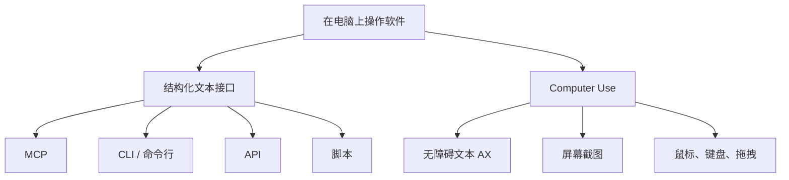

这里的重点不是谁高级谁低级，而是优先级。\
对模型来说，文本接口通常更稳定、更省 token、更容易一次做对。GUI 操作更像备用方案。

## 二、Blender 实验：看起来在操作软件，其实在写脚本

作者打开 Codex，切到 Agent 模式，再打开 Blender，让模型“在 Blender 里画个球”。中间还遇到 macOS 系统版本过低的问题，升级之后继续。

结果不是鼠标在屏幕上点点点，而是模型打开了 Blender 的脚本控制台，开始写脚本。

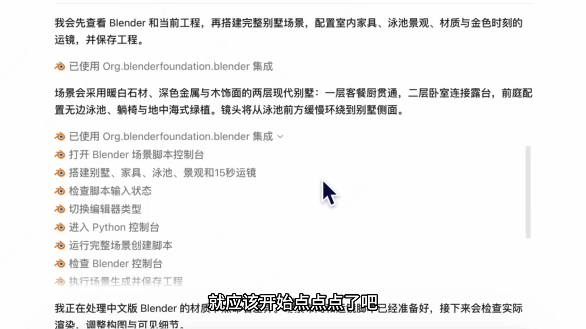

Blender 的脚本控制台可以理解成一个输入代码的地方，格式类似 Python。输入一行代码，它就能在画面中心画出一个球。

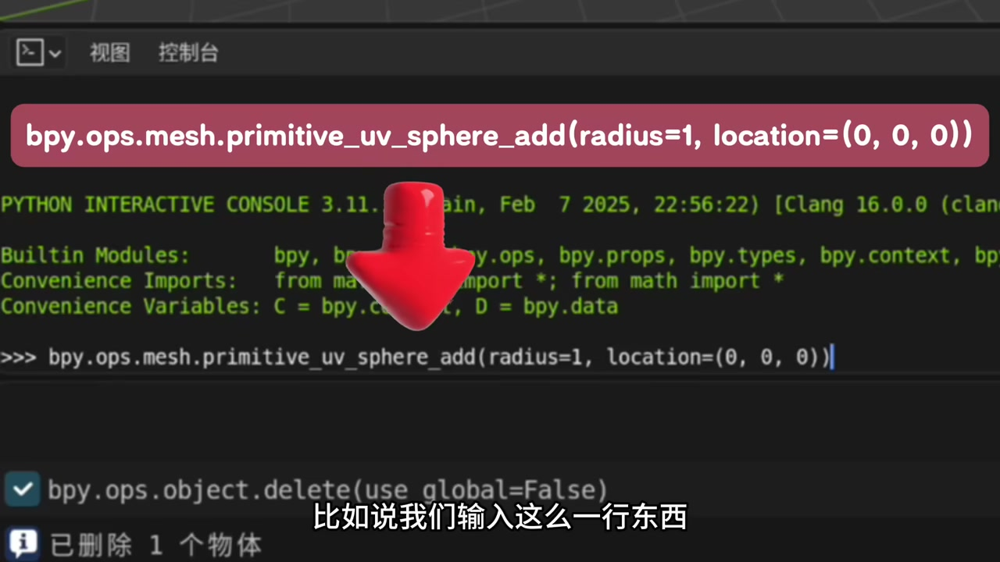

后面那个“永世别墅”的例子更明显。模型不是靠鼠标一个个摆家具，而是用大量脚本创建了几百个对象，最后包含 650 个场景对象。整个过程中，唯一比较像 GUI 操作的动作，可能只是点到脚本控制台里面。

所以这里的关键是：\
**表面上它在“操作 Blender”，实际上它主要在写代码。**

对人类来说，用脚本一行一行建别墅很反常；但对模型来说，这反而更自然。因为模型本来就更擅长处理文本和代码，而不是移动鼠标、精确点击。

## 三、Keynote 实验：这次真的点鼠标了，但背后还是文本

为了看到“模型像人一样操作界面”，作者换了一个更简单的软件：Keynote，也就是 Windows 上的 PPT。任务是在里面画一个神经网络。

这次画面看起来确实符合直觉：模型移动鼠标，一笔一笔画图，中间还画错了两根线，最后自查并纠正。

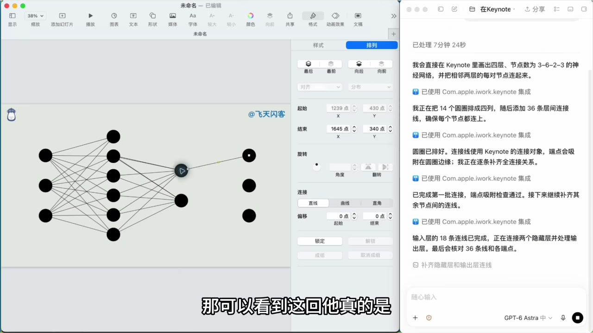

但如果继续追查它每一步到底做了什么，会发现事情并不简单。

第一步不是“看屏幕找按钮”，而是调用了一个叫 `getapp` 的方法，传入名字 `keynote`，然后返回一大段文本。这段文本描述的是 Keynote 当前的状态信息。

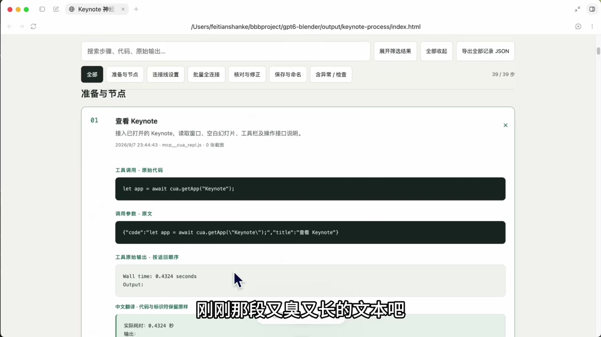

更重要的是 Computer Use 的工具说明里有一句话：\
如果有专用连接器、API 或命令行工具，优先使用它们。

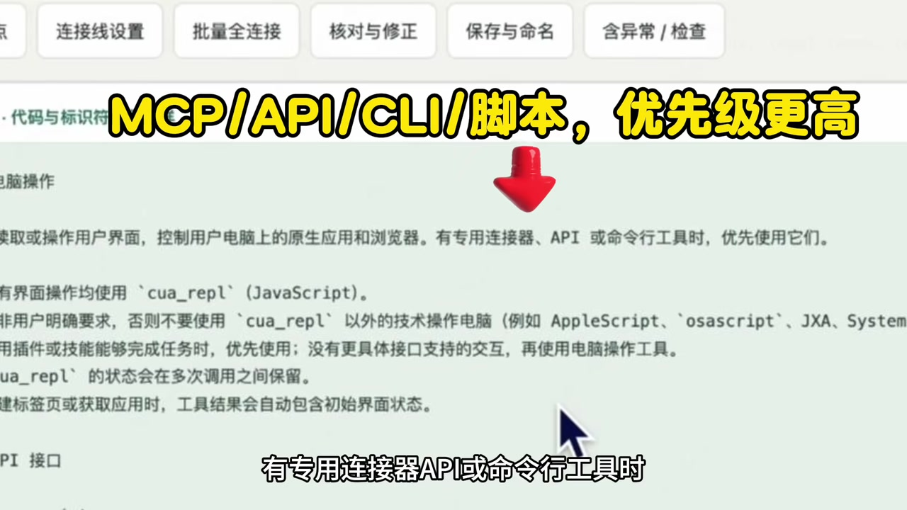

这句话说明，GUI 操作不是第一选择，而是排在连接器、API、命令行、脚本之后的备用方案。\
这也解释了为什么在 Blender 里，模型会优先写脚本，而不是用鼠标建模。

## 四、即使必须操作界面，它也不是直接“看图”

工具说明里还有一句很关键：执行一个或多个界面动作后，在决定下一步之前，要调用 `getAXState` 方法，掌握当前页面状态，并从最新的无障碍文本中重新获取元素信息，避免沿用过期信息。

`getAXState` 返回的是“无障碍文本”。

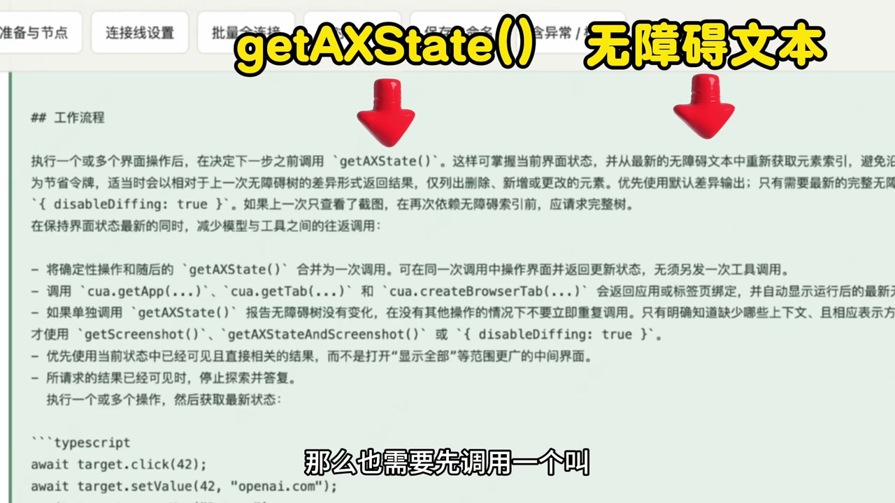

无障碍文本可以理解成：把屏幕上的界面结构，用文字描述出来。比如有哪些窗口、按钮、输入框、菜单、元素位置和状态。它不是一张图片，而是一段结构化文字。

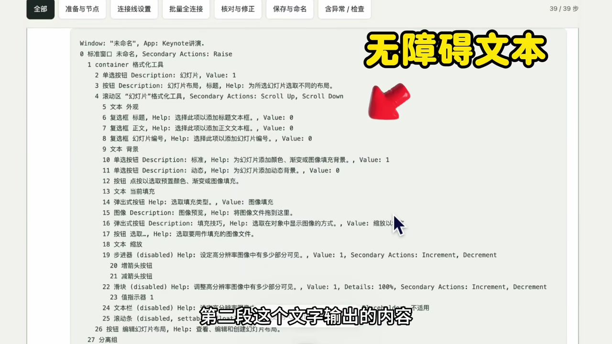

后续步骤里，模型会优先读取这种文本，而且还会用增量描述的方式，只告诉模型变化的部分，从而节省 token。

这个无障碍文本来自哪里？\
来自 macOS 的辅助功能权限，也就是“无障碍”功能。它本来是帮助视障人士了解屏幕内容的。比如打开旁白，电脑可以把屏幕内容读出来。

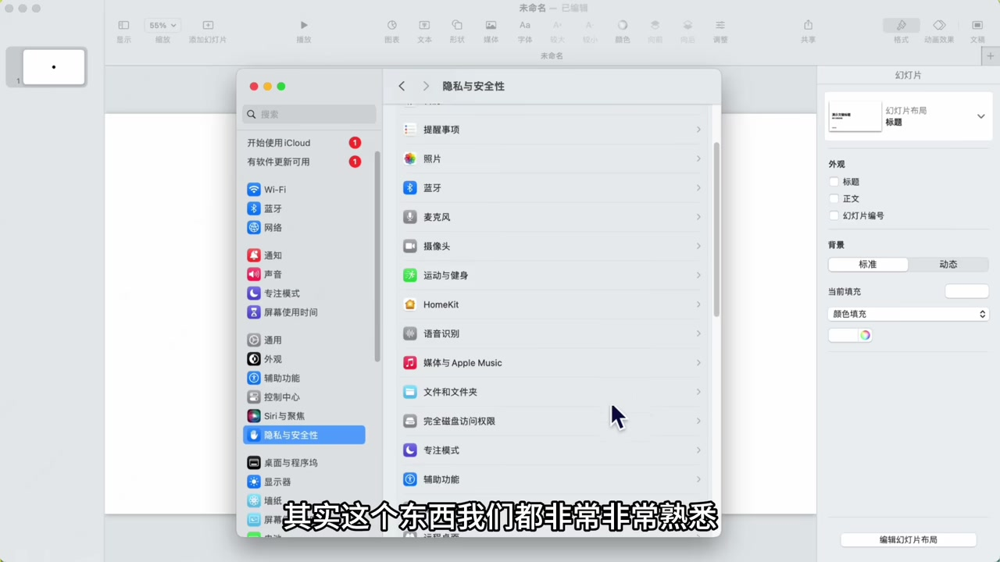

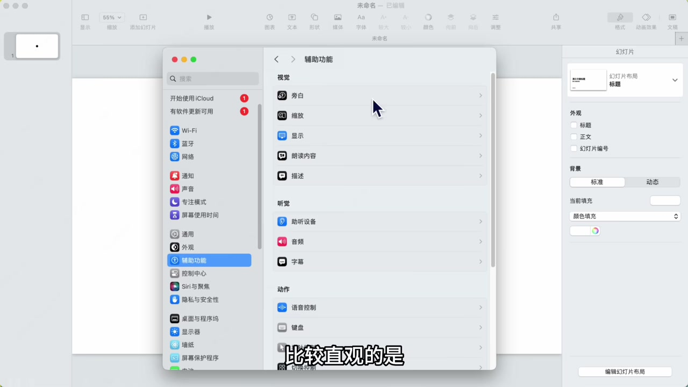

更底层，它依赖苹果官方的 AX 接口。这个接口返回类似树状结构的屏幕信息，由各个 App 自己提供，对接苹果的无障碍系统。

所以 Keynote 这个例子里，虽然模型看起来在移动鼠标、点击界面，但底层大部分信息仍然来自纯文本，而不是大模型直接看屏幕截图理解画面。

## 五、开头那个“自己家的 3D 画面”也不是 Blender

视频开头作者用自家图片生成了一个第一视角 3D 画面。这个例子容易让人以为它也是在 Blender 里操作出来的。

但实际上，它只是在 ChatGPT 网页端上传了一堆图片，然后生成了一个纯 HTML 页面，使用的是 Three.js 这个 3D 库。

最后加载和渲染速度也很快，可以直接做成第一视角游戏。

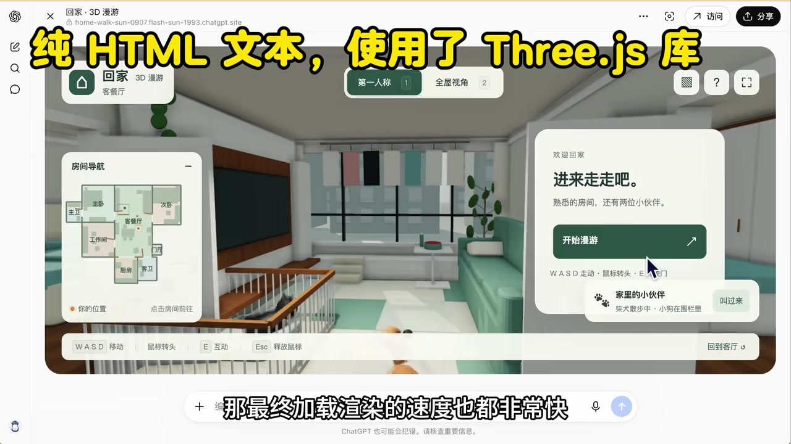

这说明网上很多看起来很酷的 3D 生成视频，不一定是用 Blender 做的。\
即使是用 Blender 做的，也不一定是手动点屏幕操作的 Blender，更可能是 CLI、MCP、API 或脚本操作。

## 六、为什么这次 GPT-6 和 Blender 会火出圈？

可以归纳成几个原因：

1. Computer Use 能力确实大幅提升了。作者也试过其他 Agent 产品，做不出这样的效果。
2. 它的能力刚好达到一个阈值：可以一次性、比较丝滑、没有明显卡点地完成一个三维作品创作。
3. 它的工具选择设计很合理。Computer Use 的优先级低于 MCP、CLI、API 或脚本。模型会先选自己更擅长、效率更高的方式。
4. 大模型本质上还是更擅长和文本打交道。它的处理逻辑和人不一样，效率也可能更高。

作者还提到，之前用 AppleScript 操作 Keynote 也可以画神经网络。但模型评估后，可能发现直接用 macOS 辅助功能更方便。这也是它智能的体现：不是所有操作都要硬生生去读屏幕。

## 七、一句话总结

Computer Use 的关键，不是“模拟人看屏幕、点鼠标”。

更准确的理解是：

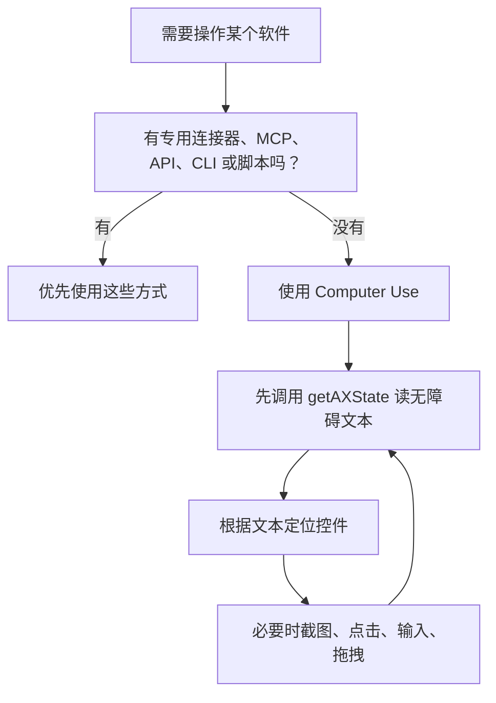

所以，“GUI 当立，CLI、脚本、API 已死”这种说法并不成立。\
相反，它们可能越来越重要。Computer Use 只是整个工具链中的一层，而且通常不是第一层。
