# GAMES101 第九讲：Shading 3（纹理映射续）

这一讲是着色部分的收尾。前面已经讲过 Blinn-Phong 着色模型、flat / Gouraud / Phong shading、图形管线和 shader。这一讲不再重点讨论“光如何与材质作用”，而是解决纹理映射真正落地时必须处理的问题：

* 三角形内部怎么插值任意属性；
* 纹理如何从屏幕像素映射到纹理颜色；
* 纹理太小或太大时分别会出现什么问题；
* Mipmap、三线性插值、各向异性过滤、EWA 分别解决什么问题。

先看整体知识地图：

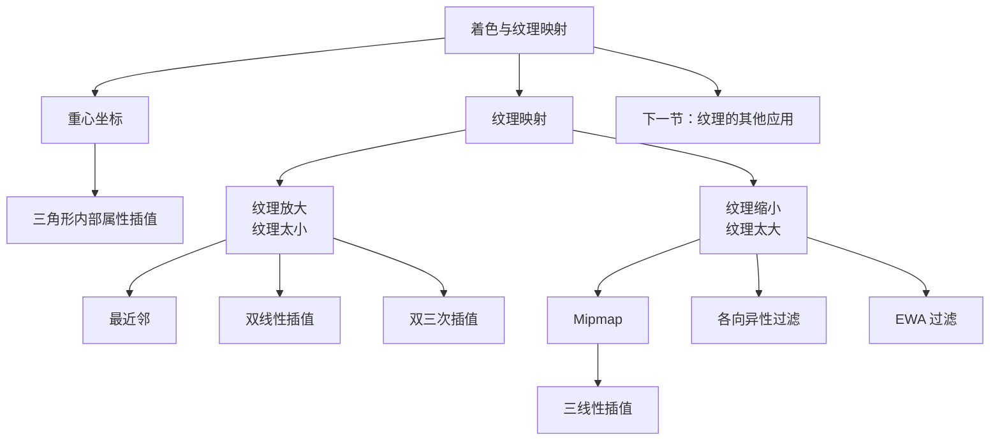

## 一、重心坐标：在三角形内部插值任意属性

光栅化时，很多属性定义在三角形的顶点上，例如颜色、法线、纹理坐标 UV、深度。到了三角形内部，我们希望这些属性从一个顶点平滑过渡到另一个顶点。\
为了统一完成这件事，引入重心坐标。

对一个三角形 ABC，平面内任意一点 P 都可以写成三个顶点的线性组合：

```text
P = αA + βB + γC
α + β + γ = 1
```

这里的 A、B、C 是顶点坐标，α、β、γ 就是点 P 的重心坐标。

如果只看“是否在三角形内部”，还要满足：

```text
α ≥ 0，β ≥ 0，γ ≥ 0
```

三个系数都非负时，P 一定在三角形内；只满足和等于 1 时，P 在三角形所在平面内，但可能在三角形外。

从定义可以直接得到几个特殊点：

* A 点：α = 1，β = 0，γ = 0；
* B 点：α = 0，β = 1，γ = 0；
* C 点：α = 0，β = 0，γ = 1；
* 三角形重心：α = β = γ = 1/3。

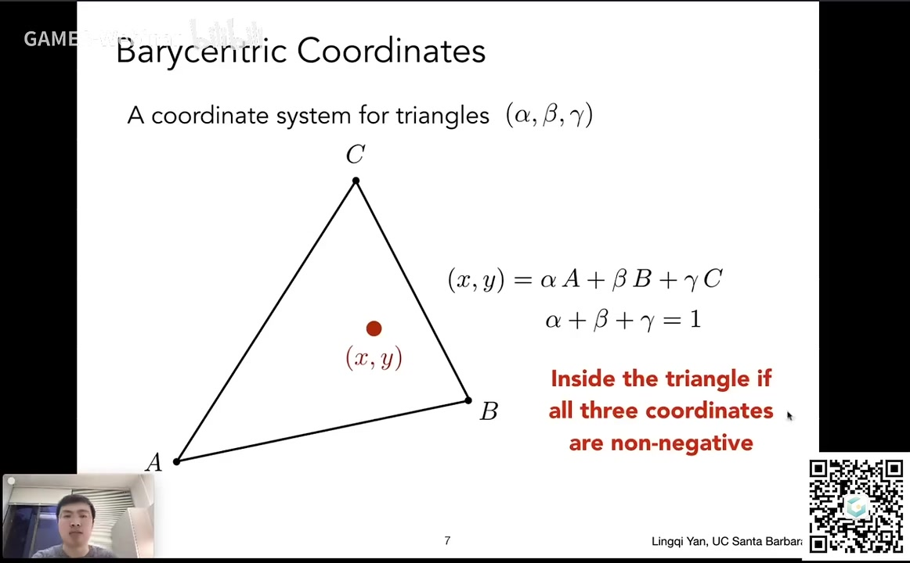

重心坐标还可以用面积比来理解。对三角形内一点 P，把它和 A、B、C 分别连线，会得到三个小三角形。某个顶点对应的重心坐标，就是它“对面”的小三角形面积除以整个三角形面积。

例如：

```text
α = Area(PBC) / Area(ABC)
β = Area(APC) / Area(ABC)
γ = Area(ABP) / Area(ABC)
```

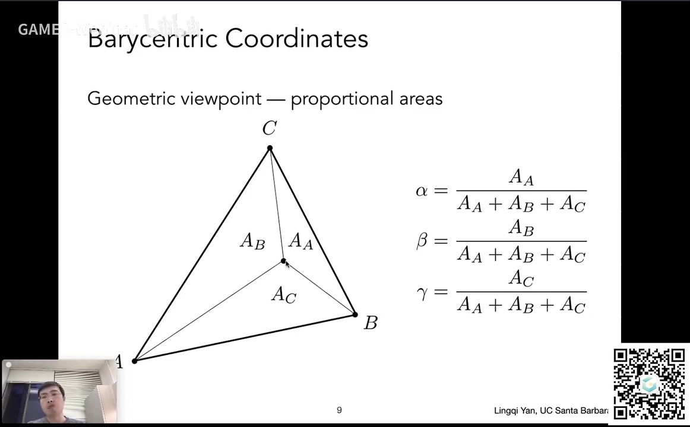

有了重心坐标，插值就变得很直接。假设三角形三个顶点上分别有属性 VA、VB、VC，那么三角形内部任意点的属性 V 可以写成：

```text
V = αVA + βVB + γVC
```

这里的属性可以是颜色、UV、法线、深度，甚至是其他自定义数据。只要它定义在顶点上，就可以用同一套重心坐标插值。

这里有一个容易出错的点：**重心坐标在投影下会变化**。\
一个三维空间中的三角形投影到屏幕上以后，形状会改变，同一个点投影前后的重心坐标通常不一样。因此，如果要插值三维空间中的属性，例如深度、世界坐标，不能直接在投影后的屏幕三角形里用屏幕坐标算重心坐标。正确做法是回到三维空间插值，或者做透视校正。

## 二、纹理映射的基本流程

纹理映射的基本过程可以用一条流程表示：

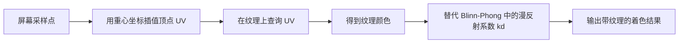

也就是说，屏幕上的某个采样点先在三角形内确定位置，然后通过重心坐标插值出它的 UV，再去纹理上查询这个 UV 对应的颜色。得到的颜色可以当作 Blinn-Phong 模型里的漫反射系数 kd。这样纹理图案就被贴到了物体表面，同时物体仍然保留高光、明暗变化等着色效果。

## 三、纹理太小：放大问题与双线性插值

先考虑一种情况：屏幕分辨率很高，但纹理分辨率很低。\
例如屏幕是 4K，纹理只有 256×256。一个 texel 会被多个 pixel 共享。若直接用四舍五入，把非整数纹理坐标变成最近的 texel，很多像素会查到同一个 texel，结果就是一块一块的格子。

这种现象叫纹理放大。解决办法是双线性插值。

双线性插值的过程是：

1. 找到查询位置周围最近的四个 texel；
2. 设查询点距离左下角 texel 的水平距离为 S，垂直距离为 T，S 和 T 都在 0 到 1 之间；
3. 先在下面两个 texel 之间按 S 做一次线性插值；
4. 再在上面两个 texel 之间按 S 做一次线性插值；
5. 最后用 T 在这两个中间结果之间做一次线性插值。

线性插值公式是：

```text
lerp(x, v0, v1) = v0 + x(v1 - v0)
```

因为水平方向做了两次，垂直方向做了一次，所以叫双线性插值。

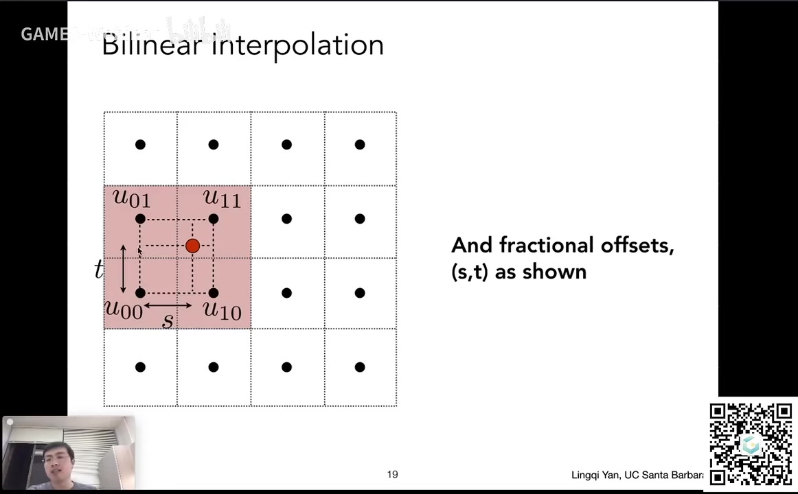

双线性插值的效果比最近邻好很多，格子感明显减弱。更好的方法是双三次插值：取周围 16 个 texel，每次用三次插值而不是线性插值。它质量更高，但运算量也更大。图形学中经常遇到这种取舍：质量越好，开销通常越高。

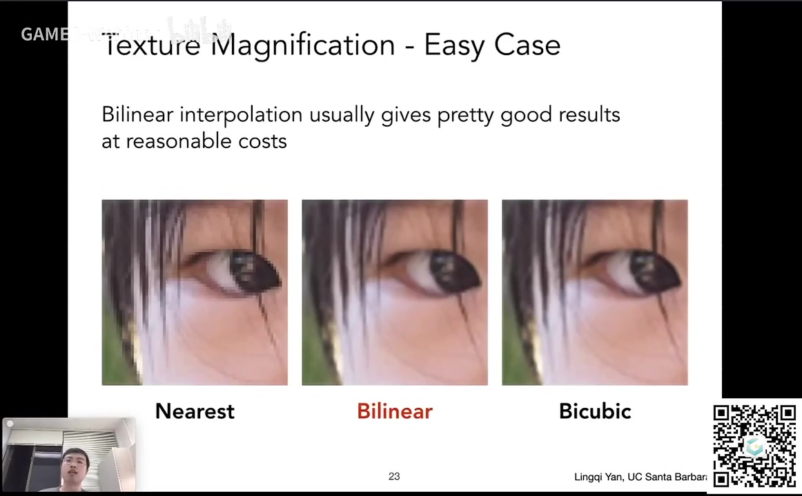

## 四、纹理太大：缩小问题与走样

另一种情况更反直觉：纹理太大也会出问题。

假设一个平面向远处延伸，上面贴着格子纹理。近处一个像素覆盖的纹理区域较小，远处一个像素覆盖的纹理区域很大。如果仍然只用像素中心去查询一个纹理点，并把这个点的值当作整个像素的颜色，远处就会出现严重的摩尔纹和锯齿。

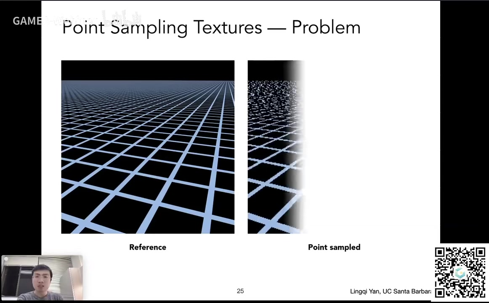

根本原因仍然是采样不足：一个像素内部包含很大一块纹理，纹理颜色变化很快，但只用一个采样点，无法代表整个区域。

超采样或 MSAA 可以缓解，但代价是每个像素要取很多样本，速度慢。更好的思路是：不做逐点采样，而是直接做范围查询——给定纹理上的一个区域，快速得到这个区域的平均值。

## 五、Mipmap 与三线性插值

Mipmap 是实现范围查询的一种经典方法。

它预先从原始纹理生成一系列分辨率逐层减半的图：

* 第 0 层：原始纹理；
* 第 1 层：长宽各减半；
* 第 2 层：再减半；
* 直到 1×1。

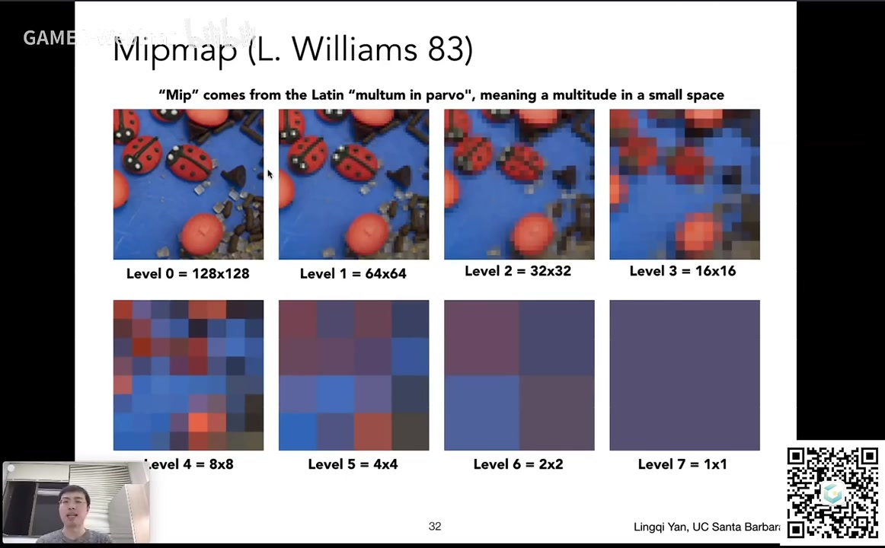

Mipmap 的额外存储量并不大。每一层面积是上一层的四分之一，所以总存储是：

```text
1 + 1/4 + 1/16 + ... = 4/3
```

也就是说，相比原始纹理，只多了约三分之一的存储。

查询时，先估计一个像素在纹理上覆盖的区域大小，近似把它看成一个正方形。取这个正方形的最大边长 L。那么它大约在第 D = log2 L 层上会接近一个 texel。去那一层查询，就可以快速得到近似平均值。

问题是，Mipmap 只有离散的整数层，而实际需要的 D 通常不是整数。如果直接取整，层与层之间会不连续。解决方法是三线性插值：

1. 在相邻两层分别做双线性插值；
2. 再在两层结果之间做一次线性插值。

这样，纹理内部是连续的，层与层之间也是连续的。

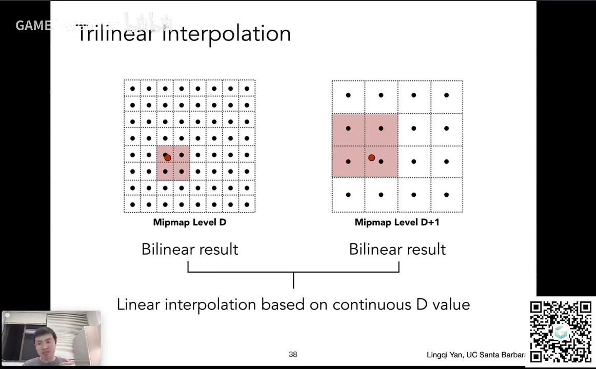

三线性插值效果很好，开销也不大，因此被广泛用于实时渲染。

## 六、各向异性过滤与 EWA

Mipmap 有一个限制：它只能近似查询正方形区域。\
但屏幕像素映射到纹理上的区域不一定是正方形，可能是长条形、斜向的，甚至是不规则形状。如果硬用正方形去包住一个长条区域，就会把很多不该平均进来的 texel 也算进去，导致远处过度模糊，也就是 over blur。

各向异性过滤就是为了解决这个问题。

它预计算的不只是长宽同时减半的图，还包括不同长宽比压缩的图：有的只在水平方向压缩，有的只在垂直方向压缩。这样查询时就可以支持矩形区域，而不是只支持正方形区域。

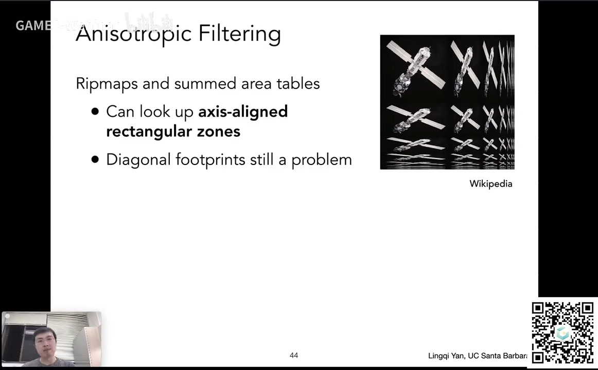

各向异性过滤的存储开销大约是原始纹理的 3 倍。游戏中常见的 2x、4x、8x、16x，指的是计算到多少层方向压缩。层数越高，结果越接近 3 倍存储，主要消耗显存，对计算性能影响通常不大。

不过，各向异性过滤仍然不能完美处理斜向或不规则区域。更高质量的方法是 EWA 过滤：把一个不规则查询区域拆成多个圆形区域，分别查询再合并。

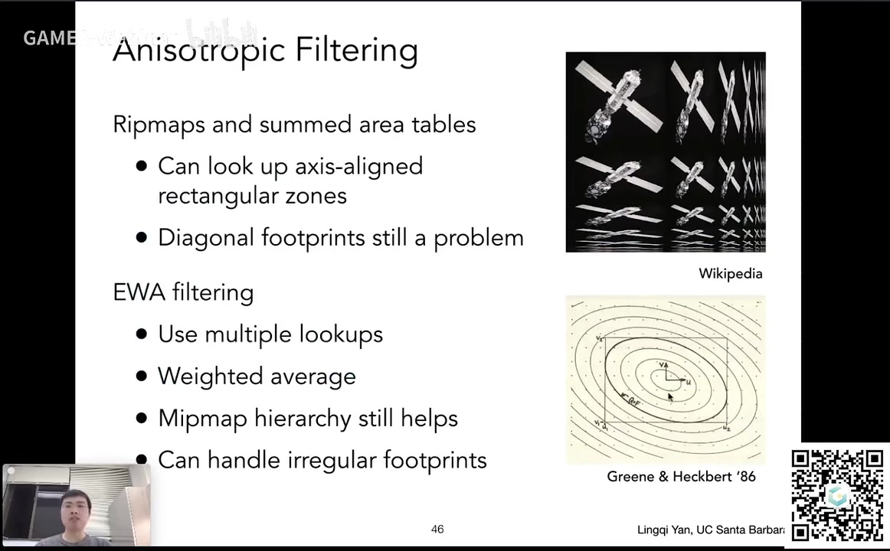

它质量更好，但需要多次查询，开销也更大。

## 七、这一讲要记住什么

可以用一个表总结：

| 问题        | 原因                    | 方法           | 关键点                        |
| --------- | --------------------- | ------------ | -------------------------- |
| 三角形内部属性过渡 | 属性只定义在顶点              | 重心坐标         | 用 α、β、γ 线性组合顶点属性           |
| 纹理贴到物体上   | 纹理坐标定义在顶点             | 插值 UV 后查询纹理  | 纹理颜色可替代漫反射系数 kd            |
| 纹理太小      | 一个 texel 被多个 pixel 共享 | 双线性插值、双三次插值  | 双线性用周围 4 个 texel，双三次用 16 个 |
| 纹理太大      | 一个像素覆盖很多 texel        | Mipmap、三线性插值 | 预计算图像金字塔，做范围查询             |
| 远处过度模糊    | Mipmap 只能近似正方形区域      | 各向异性过滤       | 支持矩形区域查询，存储约 3 倍           |
| 斜向或不规则区域  | 矩形仍不能很好覆盖             | EWA 过滤       | 拆成多个圆形查询，质量高但更慢            |

最后只记三句话：

1. **重心坐标用于在三角形内部插值任意顶点属性，例如 UV、颜色、法线和深度。**
2. **纹理映射就是插值 UV、查询纹理，再把纹理颜色用于着色。**
3. **纹理放大用双线性插值，纹理缩小用 Mipmap 和三线性插值；各向异性过滤进一步减少远处过度模糊，EWA 质量更高但更慢。**
